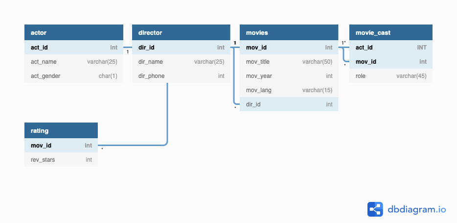

# SQL Workshop by Harsha

Following are some of tools or resources that you might need in learning SQL.

## Presentation Link

- [Link](https://slides.com/sannareddyharshavardhan/deck/live?context=editing#/)

## Resources or Reference Library

- It happens with everybody to forget syntax for functions, when that happens to you, please refer [W3 Schools](https://www.w3schools.com/)

- Ask for help in [Stackoverflow](https://stackoverflow.com/) programming community. for, most of the questions you will already find answers here..**Explore it**

## IDE or Code Editor

- You don't need to install any software in your laptop to learn `basic sql`. use, [SQL Fiddle](http://sqlfiddle.com/) web application.

    

1. Select `MySQL` from dropdown.

2. Copy contents from `script.sql` file  in `Database_Script` folder, and paste into left side window.

3. click on `Build schema`, it will create database.

4. write your `sql query`

5. click on `Run SQL`

6. query `output window`

## Practice Challenges

- [Hackerrank](https://www.hackerrank.com/)
- [LeetCode](https://leetcode.com/)

## SQL Formatter

- `We read more code then we write in our life time`. Always [format](http://www.dpriver.com/pp/sqlformat.htm) sql code for better readbility

## Regarding Notes

- Prefer always taking notes use any mobile or desktop application. I prefer using [bear](https://bear.app/) application.

## Sample database

 

## Practice Queries

- [Queries](queries.md)
